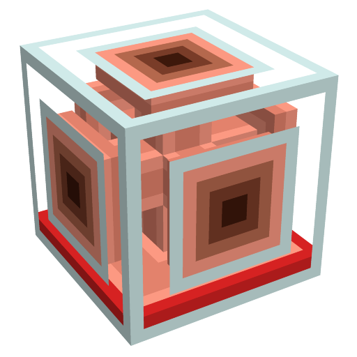
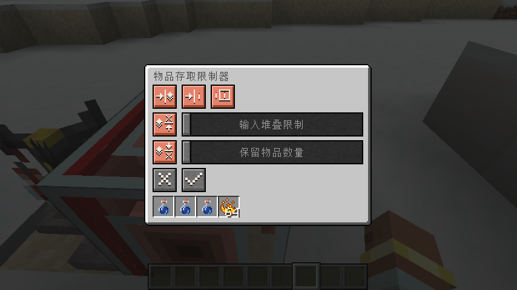

# 物品存取限制器 | [Item Access Restrictor](./README_en.md)

## 介绍

这是一个minecraft模组，这个模组添加了一种功能方块：物品存取限制器。它自身没有容量，将它贴在容器上，可以代替贴合的面进行物品的存入与取出，可以配置输入阻挡、保留n个物品等。另外也可以使用比较器读取红石信号。

## 可配置项

| 名称                       | 补充信息                                                                                                         | 范围                                     | 默认值                   |
| :------------------------- | :--------------------------------------------------------------------------------------------------------------- | :--------------------------------------- | :----------------------- |
| 在目标不为空时阻挡输入     | 禁用的槽位以及保留的物品不在目标内                                                                               | 启用、禁用                               | 启用                     |
| 在接收红石信号时阻挡输入   | 无                                                                                                               | 启用、禁用                               | 启用                     |
| 比较器输出模式             | 设置为仅计算可交互的物品与槽位时，固定使用和典型容器（如箱子、漏斗）一致的计算方式，最小为0最大为15              | 仅计算可交互的物品与槽位、与朝向方块相同 | 仅计算可交互的物品与槽位 |
| 输入堆叠限制               | 槽位存入物品的数量到达配置的数量后，将无法继续存入此槽位；会影响比较器输出红石信号的计算                         | 无限制、1—64                             | 无限制                   |
| 保留物品数量               | 槽位物品的数量降低到配置的数量后，将无法从此槽位取出物品；会影响比较器输出红石信号的计算                         | 不保留、1—64                             | 不保留                   |
| 禁用或启用槽位的存入和取出 | 当贴合容器的槽位数量发生变化时，会自动切换回启用；禁用的槽位无法存入或取出，也不会被纳入比较器输出红石信号的计算 | 启用、禁用                               | 启用                     |

## 特性

* 无法嵌套使用。
* 无法从贴合面存入、取出物品。
* 开启“在目标不为空时阻挡输入”后，支持一次性存入多种物品。目前经过验证的模组行为：ae2合成物品一次性发送多种物品时能顺利发送完毕。

## 截图

